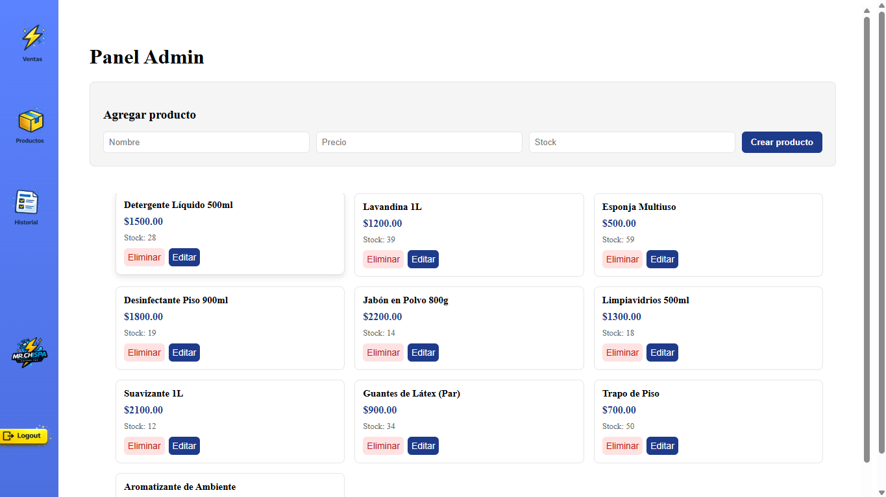
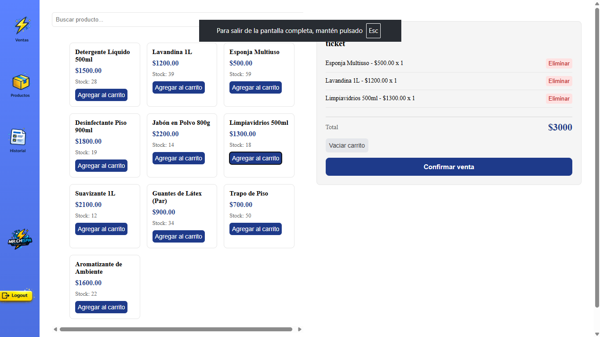
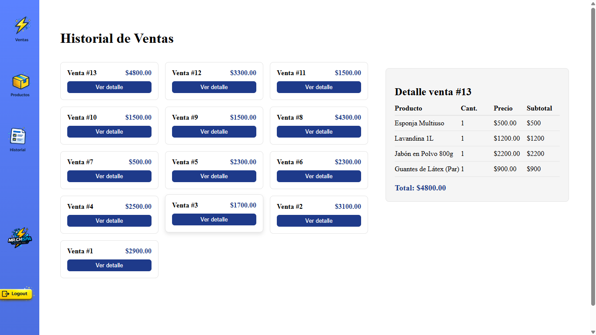

# Mr. Chispa POS

Sistema de ventas (POS) orientado a pequeños negocios. Permite gestionar productos, registrar ventas y mantener control de stock.

---

## Funcionalidades

- Gestión de productos (crear, editar, eliminar)
- Carrito de ventas
- Registro de ventas
- Control de stock
- Autenticación con JWT

---

## Tecnologías

- Frontend: React
- Backend: Node.js + Express
- Base de datos: MySQL

---

## Demo

https://www.youtube.com/watch?v=D7Dh1VpulBg

## Capturas

### Productos


### Carrito


### Venta


---

## Instalación

1. Clonar el repositorio

```bash
git clone https://github.com/nico-rotela/Mr-Chipa-Pos
